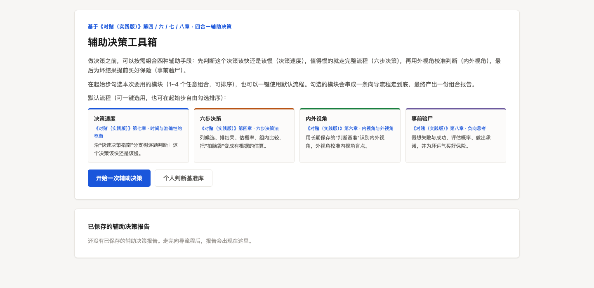
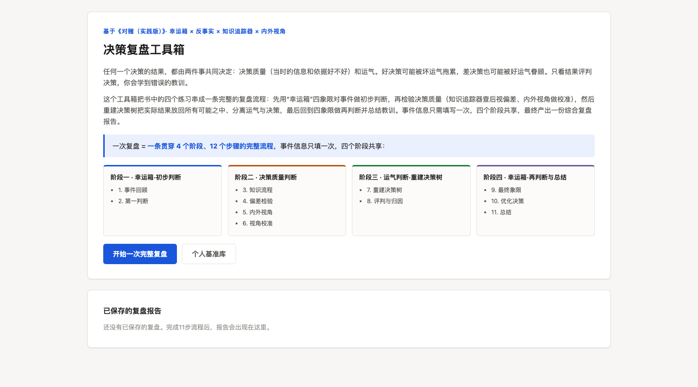

# Scientific Decide and Review Toolkit（科学决策与复盘工具箱）

一套基于安妮·杜克《对赌·实践版》（*How to Decide: Simple Tools for Making Better Choices*）各章方法论制作的**纯前端决策工具集**。按照"决策前 → 决策中 → 决策后复盘"的完整链路，覆盖书中第一章到第八章的核心练习方法。

- **零依赖、零构建**：每个工具都是一个独立的单文件 HTML，双击即可在浏览器中使用，离线可用。
- **数据完全本地**：所有填写内容只保存在你自己浏览器的 `localStorage` 中，没有任何网络请求、没有追踪、没有服务器。
- **完全开放**：MIT 协议，欢迎任何形式的二次开发、迭代和再分发。

## 工具清单

### 组合工具箱（推荐使用）

| 工具箱 | 文件 | 说明 |
| --- | --- | --- |
| [辅助决策工具箱](https://alexwongchintong-arch.github.io/scientific-decide-and-review-toolkit/%E5%B7%A5%E5%85%B7%E7%AE%B1/%E8%BE%85%E5%8A%A9%E5%86%B3%E7%AD%96%E5%B7%A5%E5%85%B7%E7%AE%B1/) | [`工具箱/辅助决策工具箱/index.html`](工具箱/辅助决策工具箱/index.html) | 将六步决策、内外视角、决策配速、事前验尸四个模块组合成一条决策前的完整向导，支持多轮事前验尸与报告归档 |
| [决策复盘工具箱](https://alexwongchintong-arch.github.io/scientific-decide-and-review-toolkit/%E5%B7%A5%E5%85%B7%E7%AE%B1/%E5%86%B3%E7%AD%96%E5%A4%8D%E7%9B%98%E5%B7%A5%E5%85%B7%E7%AE%B1/) | [`工具箱/决策复盘工具箱/index.html`](工具箱/决策复盘工具箱/index.html) | 将幸运箱、知识跟踪器、反事实检验等整合为"四阶段完整复盘"流程，可读取独立工具沉淀的基准库数据 |

**界面预览**（点击图片即可在线试用）：

| 辅助决策工具箱 | 决策复盘工具箱 |
| :---: | :---: |
| [](https://alexwongchintong-arch.github.io/scientific-decide-and-review-toolkit/%E5%B7%A5%E5%85%B7%E7%AE%B1/%E8%BE%85%E5%8A%A9%E5%86%B3%E7%AD%96%E5%B7%A5%E5%85%B7%E7%AE%B1/) | [](https://alexwongchintong-arch.github.io/scientific-decide-and-review-toolkit/%E5%B7%A5%E5%85%B7%E7%AE%B1/%E5%86%B3%E7%AD%96%E5%A4%8D%E7%9B%98%E5%B7%A5%E5%85%B7%E7%AE%B1/) |
| [在线试用 →](https://alexwongchintong-arch.github.io/scientific-decide-and-review-toolkit/%E5%B7%A5%E5%85%B7%E7%AE%B1/%E8%BE%85%E5%8A%A9%E5%86%B3%E7%AD%96%E5%B7%A5%E5%85%B7%E7%AE%B1/) | [在线试用 →](https://alexwongchintong-arch.github.io/scientific-decide-and-review-toolkit/%E5%B7%A5%E5%85%B7%E7%AE%B1/%E5%86%B3%E7%AD%96%E5%A4%8D%E7%9B%98%E5%B7%A5%E5%85%B7%E7%AE%B1/) |

### 独立工具（按书中章节顺序）

| 章节 | 工具 | 文件 | 说明 |
| --- | --- | --- | --- |
| 第一章 | [幸运箱 · 四象限复盘](https://alexwongchintong-arch.github.io/scientific-decide-and-review-toolkit/%E5%A4%8D%E7%9B%98/luck-box.html) | [`复盘/luck-box.html`](复盘/luck-box.html) | 用"决策质量 × 结果好坏"四象限区分运气与实力，避免结果论 |
| 第二章 | [知识跟踪器 · 后视偏差检验](https://alexwongchintong-arch.github.io/scientific-decide-and-review-toolkit/%E5%A4%8D%E7%9B%98/knowledge-tracker.html) | [`复盘/knowledge-tracker.html`](复盘/knowledge-tracker.html) | 记录决策时"当时知道什么"，对抗"我早就知道"的后视偏差 |
| 第三章 | [重建决策树 · 反事实检验](https://alexwongchintong-arch.github.io/scientific-decide-and-review-toolkit/%E5%A4%8D%E7%9B%98/counterfactual.html) | [`复盘/counterfactual.html`](复盘/counterfactual.html) | 重建决策时的选项树，用反事实推演检验当时的判断 |
| 第四章 | [六步决策向导](https://alexwongchintong-arch.github.io/scientific-decide-and-review-toolkit/%E8%BE%85%E5%8A%A9%E5%86%B3%E7%AD%96/six-step.html) | [`辅助决策/six-step.html`](辅助决策/six-step.html) | 走通书中标准的六步决策流程，结构化输出决策依据 |
| 第六章 | [观点跟踪 · 内外视角校准](https://alexwongchintong-arch.github.io/scientific-decide-and-review-toolkit/%E8%BE%85%E5%8A%A9%E5%86%B3%E7%AD%96/perspective.html) | [`辅助决策/perspective.html`](辅助决策/perspective.html) | 用外部基准概率校准内部直觉判断，并沉淀个人判断基准库（通用工具：决策前校准与复盘检验均可使用） |
| 第七章 | [快速决策指南 · 快与慢的权衡](https://alexwongchintong-arch.github.io/scientific-decide-and-review-toolkit/%E8%BE%85%E5%8A%A9%E5%86%B3%E7%AD%96/decision-pacing.html) | [`辅助决策/decision-pacing.html`](辅助决策/decision-pacing.html) | 判断决策值得花多少时间：可逆性、影响度与截止日期评估 |
| 第八章 | [事前验尸 · 倒推与承诺](https://alexwongchintong-arch.github.io/scientific-decide-and-review-toolkit/%E8%BE%85%E5%8A%A9%E5%86%B3%E7%AD%96/pre-mortem.html) | [`辅助决策/pre-mortem.html`](辅助决策/pre-mortem.html) | 假设未来已经失败，倒推失败原因，提前做出承诺与预案 |

> 点击"工具"列的名称即可在线打开使用；"文件"列是仓库中的源码文件。

## 快速开始

**方式一：直接使用**
克隆本仓库后，双击任意 `.html` 文件即可在浏览器中打开使用，无需安装任何东西。

```bash
git clone https://github.com/alexwongchintong-arch/scientific-decide-and-review-toolkit.git
```

**方式二：GitHub Pages（在线预览）**
在仓库设置中开启 GitHub Pages（Source 选 `main` 分支根目录）后，所有工具即可在线直接使用，无需下载：

- 落地页（工具导航）：[https://alexwongchintong-arch.github.io/scientific-decide-and-review-toolkit/](https://alexwongchintong-arch.github.io/scientific-decide-and-review-toolkit/)
- 每个工具都可以单独打开，例如：
  - [辅助决策工具箱](https://alexwongchintong-arch.github.io/scientific-decide-and-review-toolkit/%E5%B7%A5%E5%85%B7%E7%AE%B1/%E8%BE%85%E5%8A%A9%E5%86%B3%E7%AD%96%E5%B7%A5%E5%85%B7%E7%AE%B1/)
  - [决策复盘工具箱](https://alexwongchintong-arch.github.io/scientific-decide-and-review-toolkit/%E5%B7%A5%E5%85%B7%E7%AE%B1/%E5%86%B3%E7%AD%96%E5%A4%8D%E7%9B%98%E5%B7%A5%E5%85%B7%E7%AE%B1/)
  - [六步决策向导](https://alexwongchintong-arch.github.io/scientific-decide-and-review-toolkit/%E8%BE%85%E5%8A%A9%E5%86%B3%E7%AD%96/six-step.html)
  - [幸运箱 · 四象限复盘](https://alexwongchintong-arch.github.io/scientific-decide-and-review-toolkit/%E5%A4%8D%E7%9B%98/luck-box.html)

> 本仓库所有工具均为免构建的单文件 HTML，文件路径即访问路径，Pages 开启后无需任何额外配置。

> 提示：工具箱会读取同域下独立工具沉淀的基准库数据。如果你希望"独立工具填写、工具箱汇总"的联动生效，请保持整个仓库在同一域名/同一本地环境下访问（GitHub Pages 天然满足）。

## 数据与隐私

- 所有数据仅存储于浏览器的 `localStorage`，主要键名包括：
  - 独立工具：`pv_baseline`（判断基准库）、`luckbox_myex`（幸运箱案例）、`kt_examples`（知识跟踪案例）等；
  - 工具箱：`ad_reports` / `ad_draft`（辅助决策工具箱报告与草稿）及各复盘工具的报告键。
- 清除数据：在浏览器中清除对应站点的站点数据（或开发者工具 → Application → Local Storage → 删除对应键）即可彻底删除全部记录。
- 仓库中的 HTML 文件**不包含任何用户数据**，可安全地 Fork、分发。
- 跨工具联动：两个工具箱会实时读取独立工具的基准库键，实现"一次沉淀、多处复用"。

## 目录结构

```
scientific-decide-and-review-toolkit/
├── index.html              # GitHub Pages 落地页（工具导航）
├── 辅助决策/               # 决策前 / 决策中：4 个独立工具
│   ├── six-step.html
│   ├── perspective.html
│   ├── decision-pacing.html
│   └── pre-mortem.html
├── 复盘/                   # 决策后：3 个独立工具
│   ├── luck-box.html
│   ├── knowledge-tracker.html
│   └── counterfactual.html
├── 工具箱/                 # 组合向导
│   ├── 辅助决策工具箱/index.html
│   └── 决策复盘工具箱/index.html
├── assets/                 # 界面截图（README 与落地页引用）
│   ├── toolbox-decide.png
│   └── toolbox-review.png
└── 开发模板/               # 贡献者资源
    ├── tool-engine.template.txt  # 新工具开发模板（统一样式与交互规范）
    └── demo.html                 # 模板使用示例
```

## 参与贡献

本项目的开发约定是**"按书的章节，一章一个（或一组）独立工具"**。欢迎：

- **新增工具**：书中尚未覆盖的章节或练习方法。请基于 [`开发模板/tool-engine.template.txt`](开发模板/tool-engine.template.txt) 开发，保持统一的视觉风格和交互规范（可参考 [`开发模板/demo.html`](开发模板/demo.html)）；
- **改进现有工具**：交互优化、移动端适配、无障碍、导出/导入数据等；
- **修复问题**：直接提交 Issue 或 Pull Request。

贡献时请注意：

1. 保持**单文件 HTML、零外部依赖**的原则，不引入 CDN 或构建步骤；
2. 用户数据只允许存 `localStorage`，**不得**加入任何上报、统计或外链请求；
3. 提交前确认文件中没有写入任何个人真实记录。

## 许可与声明

- 代码以 [MIT License](LICENSE) 开源。
- 本项目是读者基于《对赌·实践版》（*How to Decide*）方法论的**学习实践作品**，工具中的示例仅用于说明方法；本项目与书籍作者及出版方无关，相关方法论的思想版权归属原作者。如需引用书中原文，请购买正版书籍。
